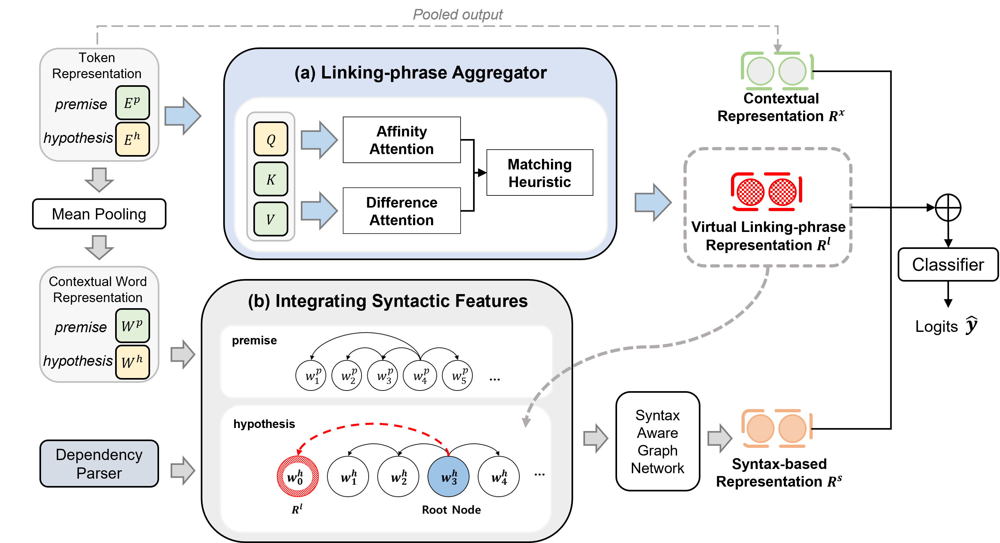

# BridgeNet
The official PyTorch implementation for our paper:*[Bridge to better understanding: Syntax extension with virtual linking-phrase for natural language inference](https://www.sciencedirect.com/science/article/pii/S0950705124012425)*
```
@article{KIM2024112608,
title = {Bridge to better understanding: Syntax extension with virtual linking-phrase for natural language inference},
journal = {Knowledge-Based Systems},
volume = {305},
pages = {112608},
year = {2024},
issn = {0950-7051},
doi = {https://doi.org/10.1016/j.knosys.2024.112608},
url = {https://www.sciencedirect.com/science/article/pii/S0950705124012425},
author = {Seulgi Kim and Seokwon Jeong and Harksoo Kim},
keywords = {Natural language inference, Linking-phrase, Syntactic structure, Graph neural networks},
abstract = {Natural language inference (NLI) models based on pretrained language models frequently mispredict the relations between premise and hypothesis sentences, attributing this inaccuracy to an overreliance on simple heuristics such as lexical overlap and negation presence. To address this problem, we introduce BridgeNet, a novel approach that improves NLI performance and model robustness by generating virtual linking-phrase representations to effectively bridge sentence pairs and by emulating the syntactic structure of hypothesis sentences. We conducted two main experiments to evaluate the effectiveness of BridgeNet. In the first experiment using four representative NLI benchmarks, BridgeNet improved the average accuracy by 1.5%p over the previous models by incorporating virtual linking-phrase representations into syntactic features. In the second experiment assessing the robustness of NLI models, BridgeNet improved the average accuracy by 7.0%p compared with other models. These results reveal the promising potential of our proposed method of bridging premise and hypothesis sentences through virtual linking-phrases.}
}
```

## Environment
```
conda create -n BridgeNet python=3.7.7
conda activate BridgeNet
pip install -r requirements.txt
```
## Model Structure


## Training Your Own Models
```
python run_nli.py --seed 42 --data_dir ./data/snli/LALParser --model_name_or_path bert-base --output_dir ./snli/parameter/AffinityDiffProposedModel/mix5_mean/LabelNode_wo_Pair2Label_lr2e5 --num_labels 3 --num_train_epochs 5 --from_init_weight true --do_train true --do_predict false
```

## Evaluation/Inference With Pretrained Models
```
python run_nli.py --data_dir ./data/snli/LALParser --model_name_or_path bert-base --output_dir ./snli/parameter/AffinityDiffProposedModel/mix5_mean/LabelNode_wo_Pair2Label_lr2e5 --num_labels 3 --do_train false --do_predict true
```
